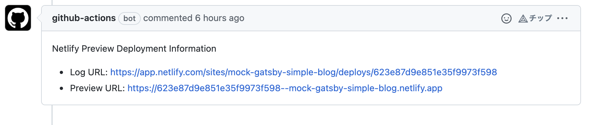

# Netlify Deploy with Comments

Github action to deploy to Netlify with Comments of Preview and Log URL.

## Table of contents

* [Usage](#usage)
* [Options](#options)
* [Examples](#examples)
  * [GatsbyJS with yarn](#gatsbyjs-with-yarn)
  * [GatsbyJS with npm](#gatsbyjs-with-npm)
* [License](#license)

## Usage

1. Add your Netlify `Personal Access Token` & Web site's `Site ID` to your repository's secrets.

    [https://docs.netlify.com/cli/get-started/#obtain-a-token-in-the-netlify-ui](https://docs.netlify.com/cli/get-started/#obtain-a-token-in-the-netlify-ui)


2. Add one step to your Github's jobs.

    ※. This action uses `yarn` as default dependency manager. If you want to use another dependency manager, you need to override each input.

    Following settings will deploy your site to preview mode in Netlify and add a comment to the pull request with the URL of the preview and the log.

    

    ```yaml
    jobs:
      deploy:
        steps:
          - name: deploy to preview mode
            uses: thundermiracle/netlify-deploy@v1
            with:
              NETLIFY_AUTH_TOKEN: ${{ secrets.NETLIFY_AUTH_TOKEN}}
              NETLIFY_SITE_ID: ${{ secrets.NETLIFY_SITE_ID}}
              deploy_dir: "./public"
              production: false
              node: 14
    ```

    ※. For production mode, you need to add `production: true` to the `with` section.

## Options

| input | required | default | description |
| :--- | :--: | :-: | :--- |
| NETLIFY_AUTH_TOKEN | ○ |  | Auth token of your Netlify, usually passed by [`secrets`](https://docs.github.com/en/actions/security-guides/encrypted-secrets) |
| NETLIFY_SITE_ID | ○ |  | Your website id in Netlify, usually passed by [`secrets`](https://docs.github.com/en/actions/security-guides/encrypted-secrets) |
| deploy_dir |  | ./dist | Directory to be uploaded to Netlify |
| production | △ | false | Deploy to production mode flag |
| node |  | 14 | Node version to run deployment |
| build_command | △ | yarn build | |
| install_command | △ | yarn --check-files --frozen-lockfile --non-interactive | ※ You should override it if you're not using yarn as your dependency manager |
| cache_path | | node_modules | |
| cache_strategy | △ | yarn | `yarn`, `npm`, or `pnpm` |
| working-directory | | | Working directory of your project |

## Examples

### GatsbyJS with yarn

1. For Pull Request, create a `.github/workflows/preview.yml` file with the following content.

    ```yaml
    name: 'Netlify Preview Deploy'

    on:
      pull_request:
        types: ['opened', 'edited', 'synchronize']

    jobs:
      deploy-preview:
        name: 'Deploy Preview'
        runs-on: ubuntu-latest

        steps:
          - name: deploy to preview mode
            uses: thundermiracle/netlify-deploy@v1
            with:
              NETLIFY_AUTH_TOKEN: ${{ secrets.NETLIFY_AUTH_TOKEN}}
              NETLIFY_SITE_ID: ${{ secrets.NETLIFY_SITE_ID}}
              deploy_dir: "./public"
              cache_path: |
                .cache
                public
                node_modules
    ```

2. For production build, create a `.github/workflows/production.yml` file with the following content.

    ```yaml
    name: 'Netlify Production Deploy'

    on:
      push:
        branches:
          - main

    jobs:
      deploy:
        name: 'Deploy Production'
        runs-on: ubuntu-latest

        steps:
          - name: deploy to production mode
            uses: thundermiracle/netlify-deploy@v1
            with:
              NETLIFY_AUTH_TOKEN: ${{ secrets.NETLIFY_AUTH_TOKEN}}
              NETLIFY_SITE_ID: ${{ secrets.NETLIFY_SITE_ID}}
              deploy_dir: "./public"
              cache_path: |
                .cache
                public
                node_modules
              production: true
    ```
### GatsbyJS with npm

1. For Pull Request, create a `.github/workflows/preview.yml` file with the following content.

    ```yaml
    name: 'Netlify Preview Deploy'

    on:
      pull_request:
        types: ['opened', 'edited', 'synchronize']

    jobs:
      deploy-preview:
        name: 'Deploy Preview'
        runs-on: ubuntu-latest

        steps:
          - name: deploy to preview mode
            uses: thundermiracle/netlify-deploy@v1
            with:
              NETLIFY_AUTH_TOKEN: ${{ secrets.NETLIFY_AUTH_TOKEN}}
              NETLIFY_SITE_ID: ${{ secrets.NETLIFY_SITE_ID}}
              deploy_dir: "./public"
              cache_path: |
                .cache
                public
                node_modules
              cache_strategy: npm
              install_command: npm install --production
              build_command: npm run build
    ```

2. For production build, create a `.github/workflows/production.yml` file with the following content.

    ```yaml
    name: 'Netlify Production Deploy'

    on:
      push:
        branches:
          - main

    jobs:
      deploy:
        name: 'Deploy Production'
        runs-on: ubuntu-latest

        steps:
          - name: deploy to production mode
            uses: thundermiracle/netlify-deploy@v1
            with:
              NETLIFY_AUTH_TOKEN: ${{ secrets.NETLIFY_AUTH_TOKEN}}
              NETLIFY_SITE_ID: ${{ secrets.NETLIFY_SITE_ID}}
              deploy_dir: "./public"
              cache_path: |
                .cache
                public
                node_modules
              production: true
              cache_strategy: npm
              install_command: npm install --production
              build_command: npm run build
    ```

## License

This project is licensed under the terms of the [MIT license](/LICENSE).
